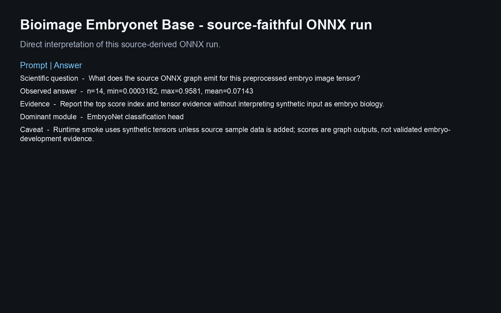
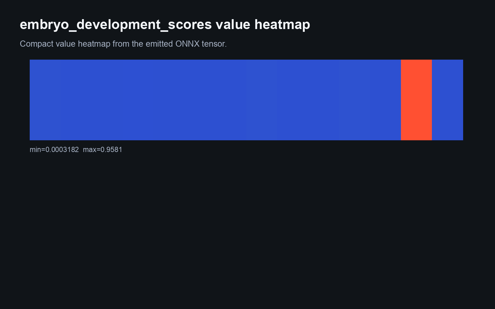
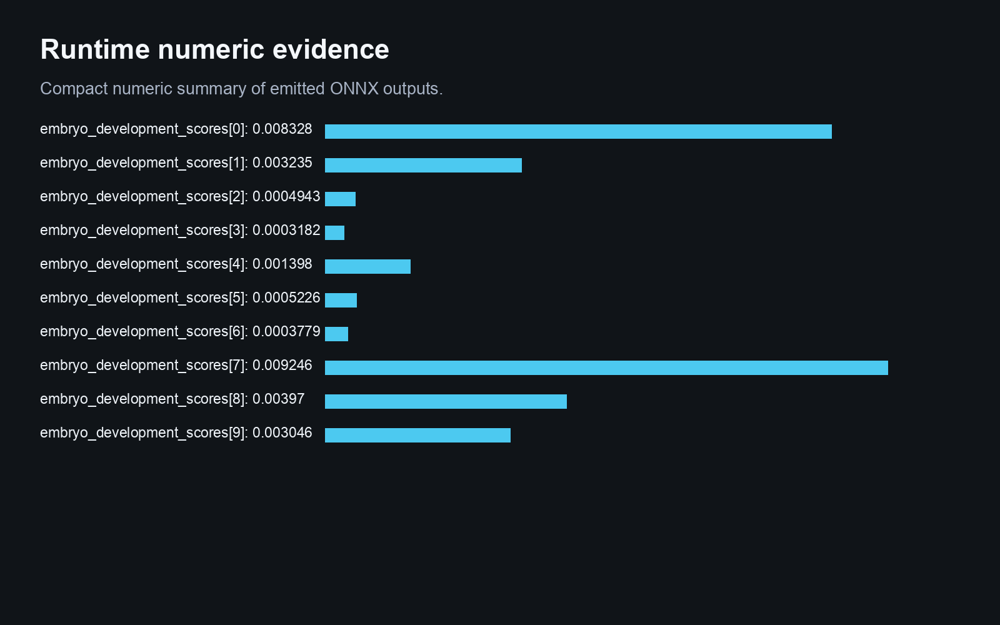
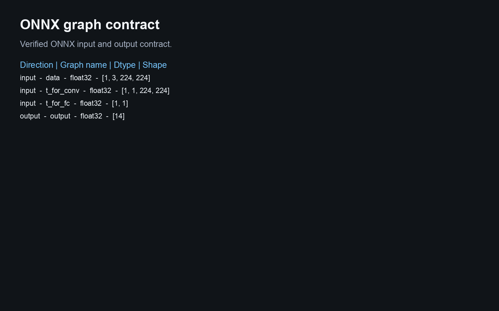
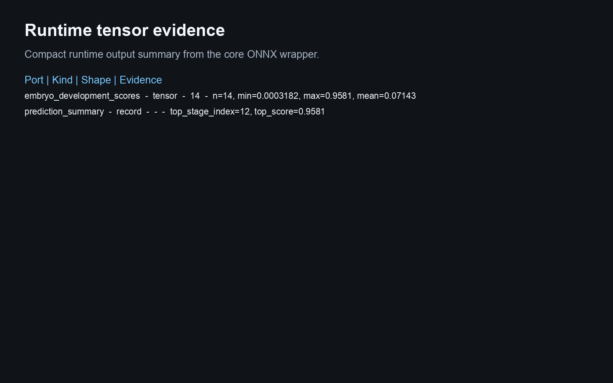
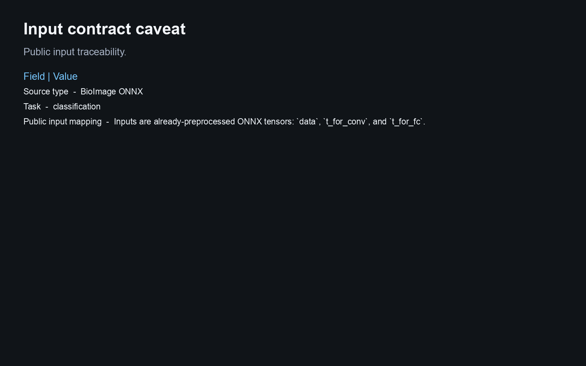

# Bioimage Embryonet Base

This Biosimulant lab wraps a source-derived ONNX artifact and reports runtime evidence from the bundled graph.

## Scientific Context

EmbryoNet embryo-stage classification from an imported BioImage.io ONNX graph.

## Source And Artifact

- `rdf`: https://bioimage-io.github.io/collection-bioimage-io/rdfs/10.5281/zenodo.7315440/7315441/rdf.yaml
- `onnx`: https://zenodo.org/api/records/7315441/files/EmbryoNet_GPU_batch_1.onnx/content

- ONNX artifact: `models/core/artifacts/model.onnx`
- Runtime: ONNX Runtime CPU execution provider
- Validation scope: graph load, input/output contract, finite synthetic inference, Biosimulant wiring, and visual payloads

## Inputs

- `embryo_image`: Inputs are already-preprocessed ONNX tensors: `data`, `t_for_conv`, and `t_for_fc`.
- `convolution_time_map`: Inputs are already-preprocessed ONNX tensors: `data`, `t_for_conv`, and `t_for_fc`.
- `stage_time_scalar`: Inputs are already-preprocessed ONNX tensors: `data`, `t_for_conv`, and `t_for_fc`.

The lab does not add raw image, raw text, raw protein sequence, tokenizer, or medical-image preprocessing unless that
preprocessing is bundled and validated. Public inputs are already-preprocessed tensors matching the ONNX graph contract.

## Outputs

- `embryo_development_scores`: Compact tensor evidence derived from the source-derived ONNX graph output.
- `prediction_summary`: Compact summary derived from the ONNX graph output tensor.

## Visualisations

The visualisation answers:

> What does the source ONNX graph emit for this preprocessed embryo image tensor?

It shows provenance, graph schema, runtime tensor evidence, and a conservative caveat. Synthetic inference is a runtime
smoke test, not biological, clinical, or microscopy performance evidence.

<!-- BIOSIMULANT_VISUALS_START -->

<!-- BIOSIMULANT_VISUALS_END -->

## Caveat

Runtime smoke uses synthetic tensors unless source sample data is added; scores are graph outputs, not validated embryo-development evidence.
