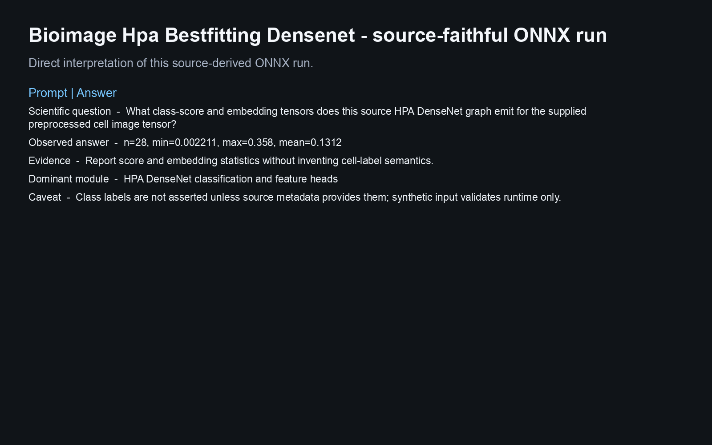
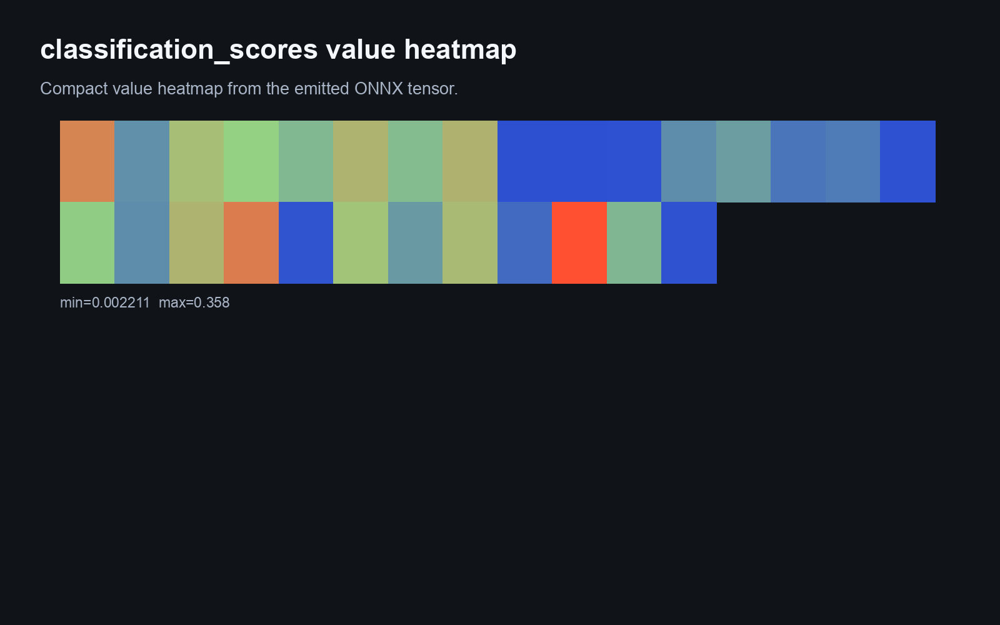
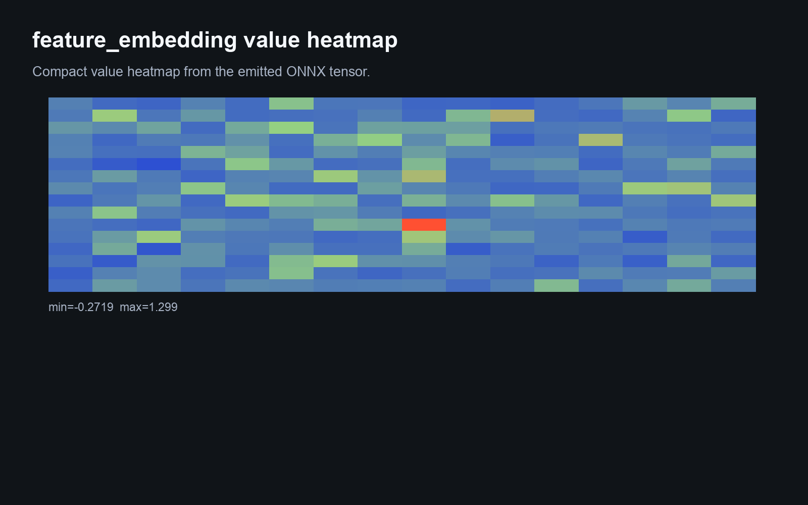
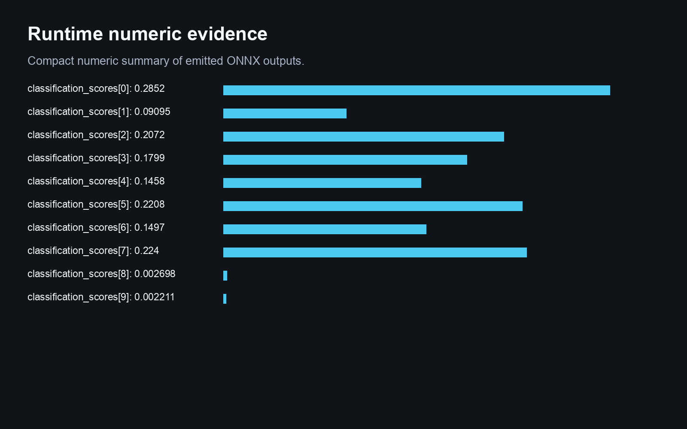
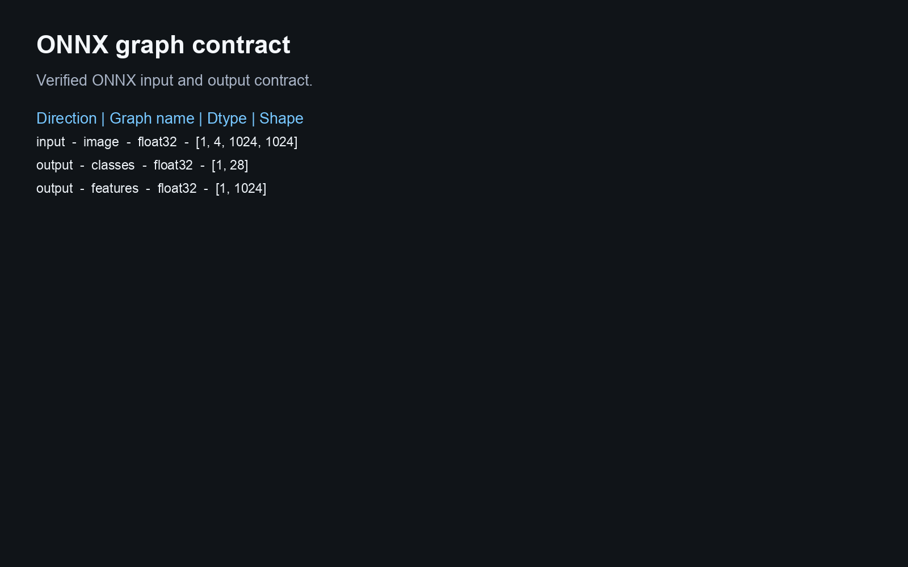
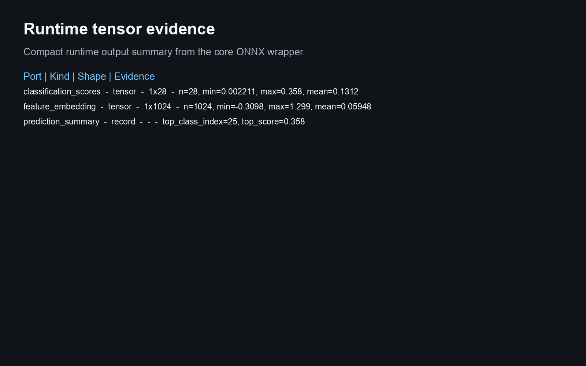
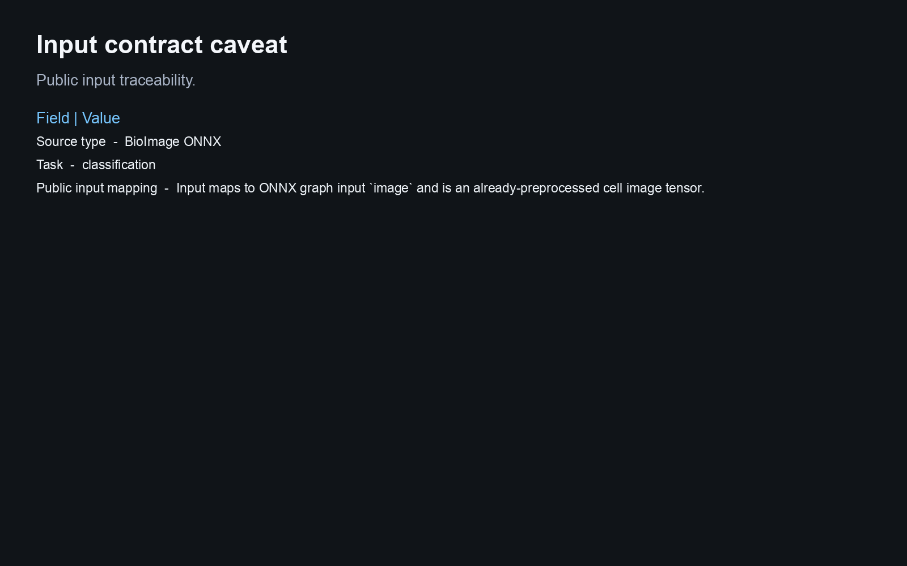

# Bioimage Hpa Bestfitting Densenet

This Biosimulant lab wraps a source-derived ONNX artifact and reports runtime evidence from the bundled graph.

## Scientific Context

Human Protein Atlas image classification and feature embedding from a BioImage.io DenseNet ONNX graph.

## Source And Artifact

- `rdf`: https://bioimage-io.github.io/collection-bioimage-io/rdfs/10.5281/zenodo.5910163/5942853/rdf.yaml
- `onnx`: https://zenodo.org/api/records/5942853/files/densenet_model.onnx/content

- ONNX artifact: `models/core/artifacts/model.onnx`
- Runtime: ONNX Runtime CPU execution provider
- Validation scope: graph load, input/output contract, finite synthetic inference, Biosimulant wiring, and visual payloads

## Inputs

- `cell_image_tensor`: Input maps to ONNX graph input `image` and is an already-preprocessed cell image tensor.

The lab does not add raw image, raw text, raw protein sequence, tokenizer, or medical-image preprocessing unless that
preprocessing is bundled and validated. Public inputs are already-preprocessed tensors matching the ONNX graph contract.

## Outputs

- `classification_scores`: Compact tensor evidence derived from the source-derived ONNX graph output.
- `feature_embedding`: Compact embedding evidence derived from the source ONNX graph output.
- `prediction_summary`: Compact summary derived from the ONNX graph output tensor.

## Visualisations

The visualisation answers:

> What class-score and embedding tensors does this source HPA DenseNet graph emit for the supplied preprocessed cell image tensor?

It shows provenance, graph schema, runtime tensor evidence, and a conservative caveat. Synthetic inference is a runtime
smoke test, not biological, clinical, or microscopy performance evidence.

<!-- BIOSIMULANT_VISUALS_START -->

<!-- BIOSIMULANT_VISUALS_END -->

## Caveat

Class labels are not asserted unless source metadata provides them; synthetic input validates runtime only.
