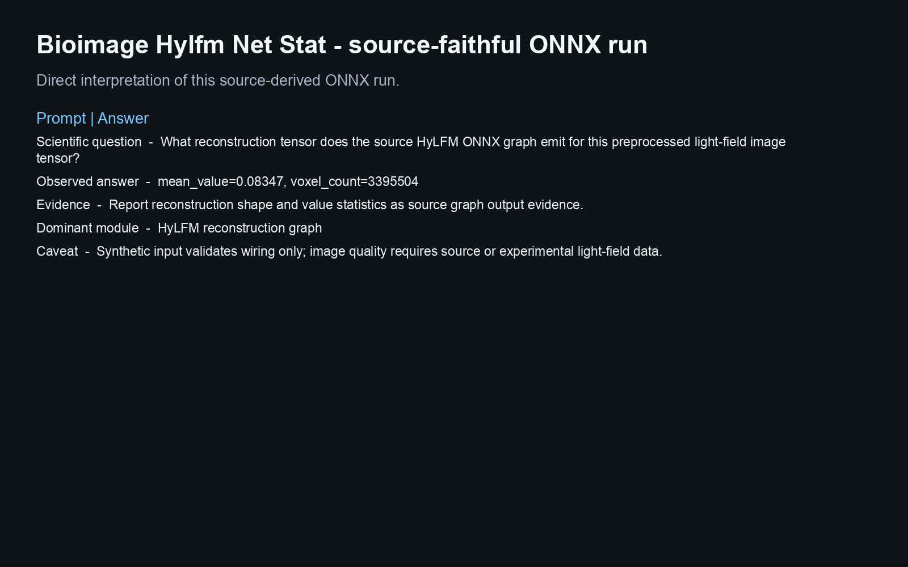
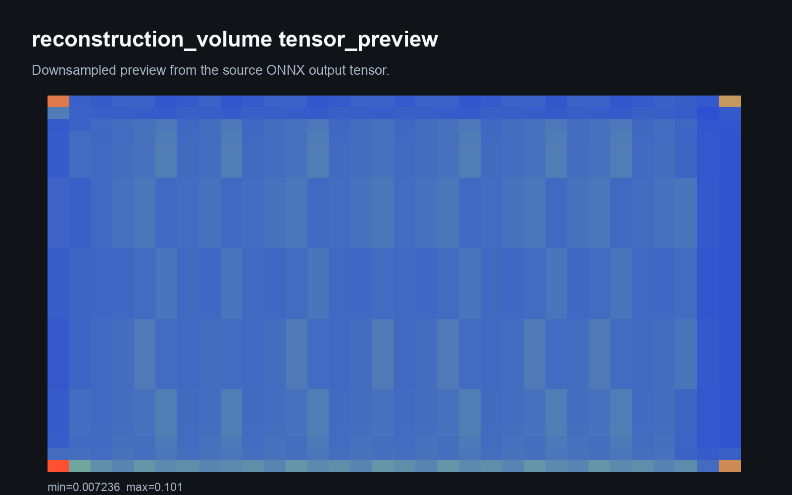
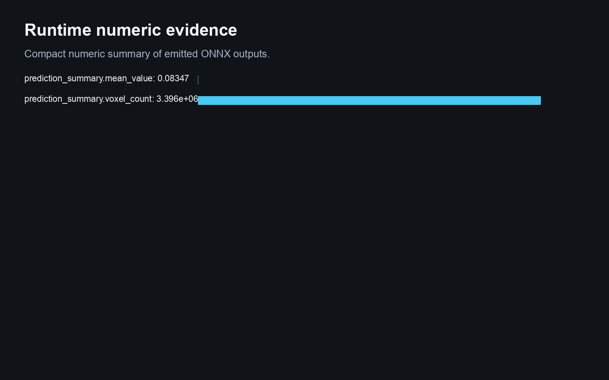
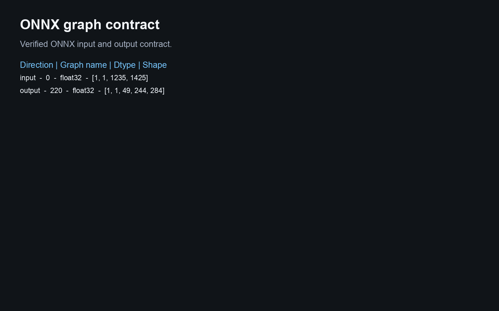
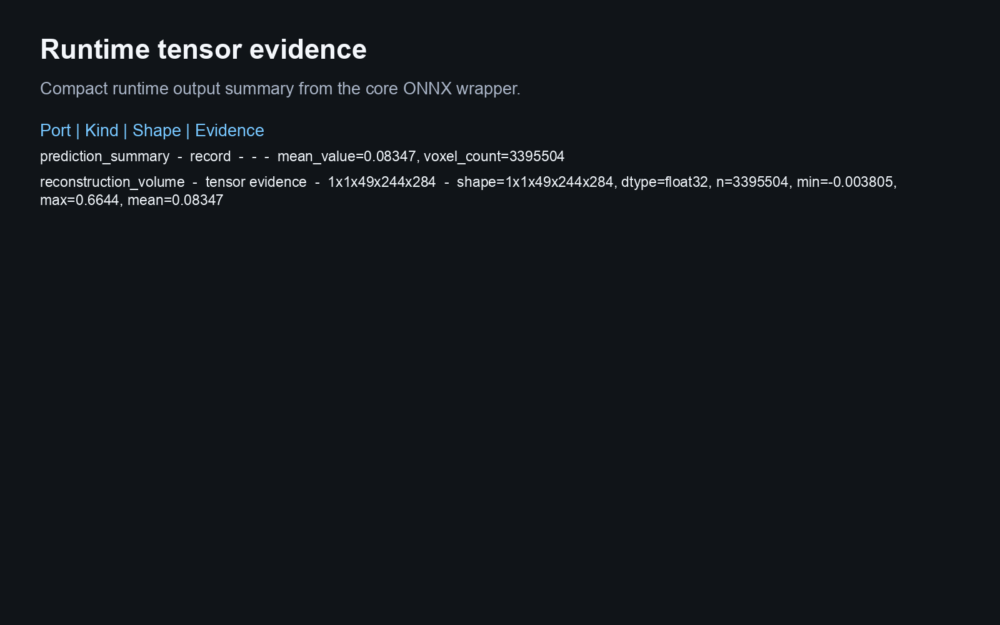
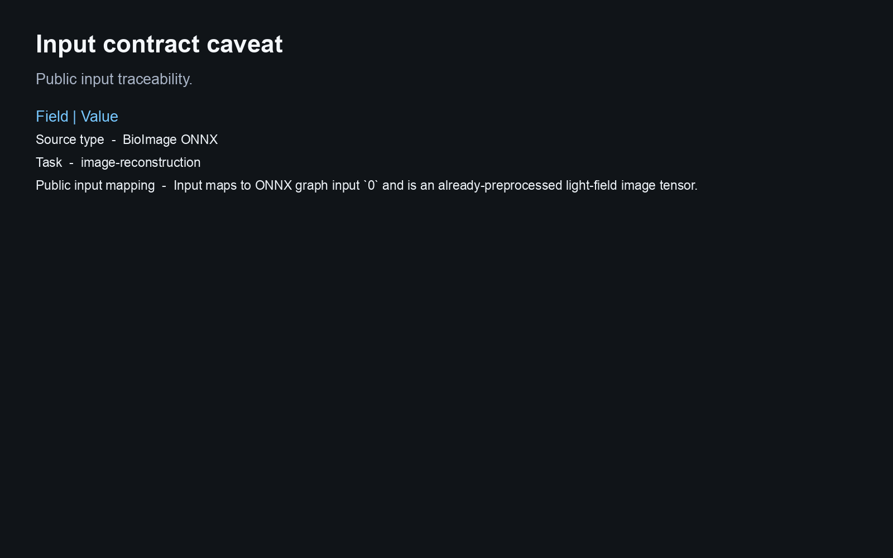

# Bioimage Hylfm Net Stat

This Biosimulant lab wraps a source-derived ONNX artifact and reports runtime evidence from the bundled graph.

## Scientific Context

HyLFM light-field microscopy reconstruction from a BioImage.io ONNX graph.

## Source And Artifact

- `rdf`: https://bioimage-io.github.io/collection-bioimage-io/rdfs/10.5281/zenodo.7614645/7642674/rdf.yaml
- `onnx`: https://zenodo.org/api/records/7642674/files/weights.onnx/content

- ONNX artifact: `models/core/artifacts/model.onnx`
- Runtime: ONNX Runtime CPU execution provider
- Validation scope: graph load, input/output contract, finite synthetic inference, Biosimulant wiring, and visual payloads

## Inputs

- `light_field_image`: Input maps to ONNX graph input `0` and is an already-preprocessed light-field image tensor.

The lab does not add raw image, raw text, raw protein sequence, tokenizer, or medical-image preprocessing unless that
preprocessing is bundled and validated. Public inputs are already-preprocessed tensors matching the ONNX graph contract.

## Outputs

- `reconstruction_volume`: Compact tensor evidence derived from the source-derived ONNX graph output.
- `prediction_summary`: Compact summary derived from the ONNX graph output tensor.

## Visualisations

The visualisation answers:

> What reconstruction tensor does the source HyLFM ONNX graph emit for this preprocessed light-field image tensor?

It shows provenance, graph schema, runtime tensor evidence, and a conservative caveat. Synthetic inference is a runtime
smoke test, not biological, clinical, or microscopy performance evidence.

<!-- BIOSIMULANT_VISUALS_START -->

<!-- BIOSIMULANT_VISUALS_END -->

## Caveat

Synthetic input validates wiring only; image quality requires source or experimental light-field data.
