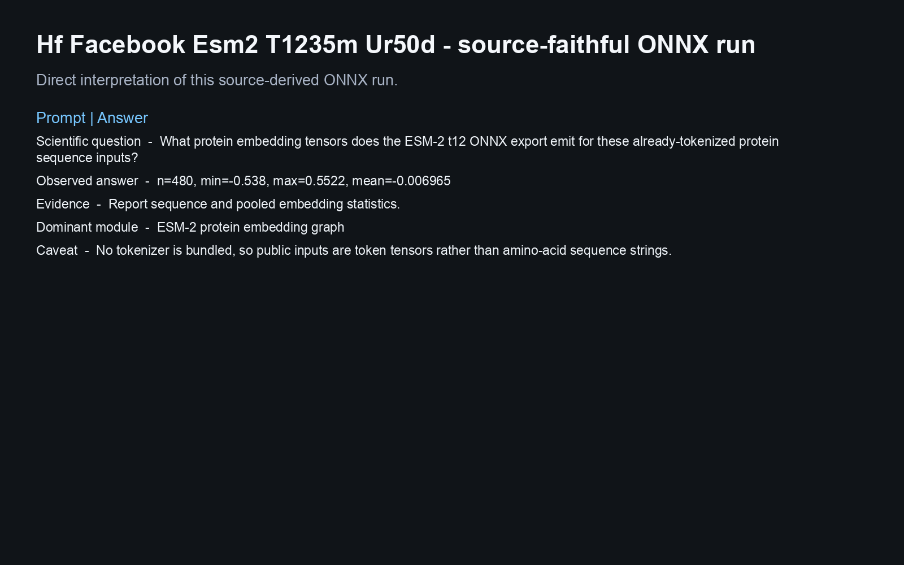
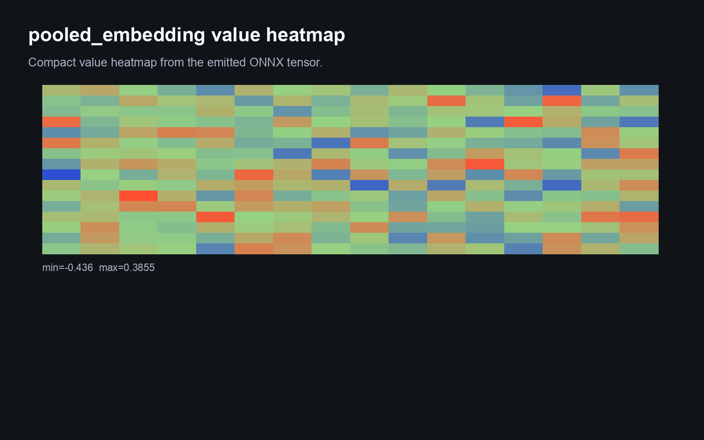
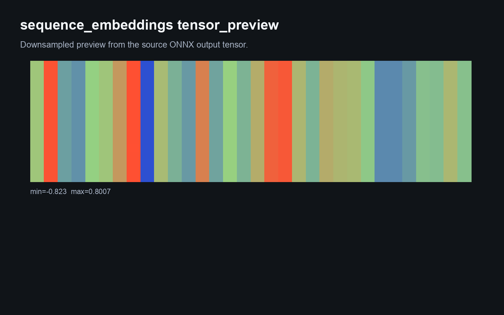
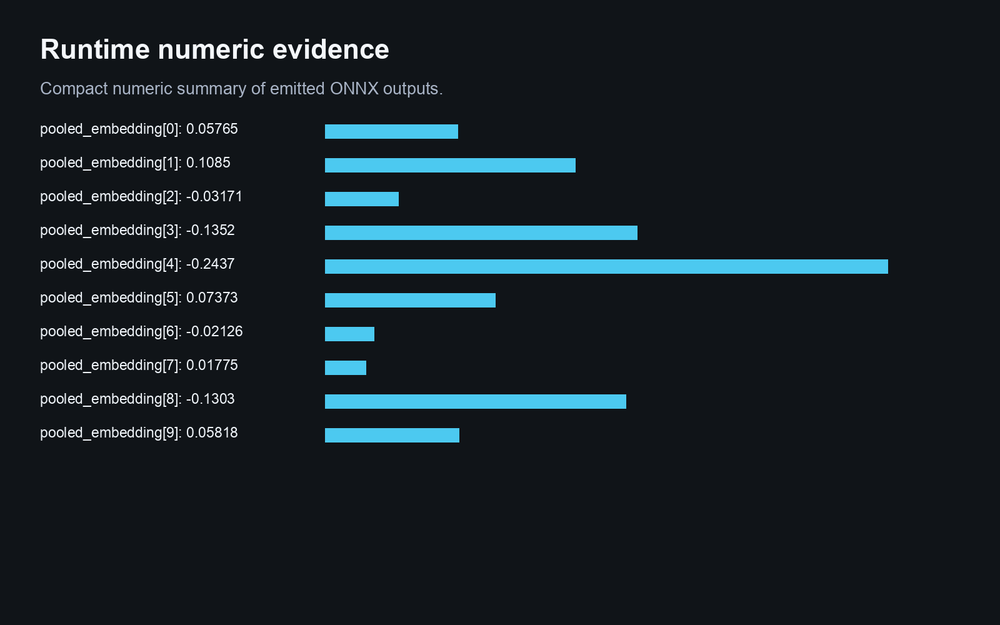
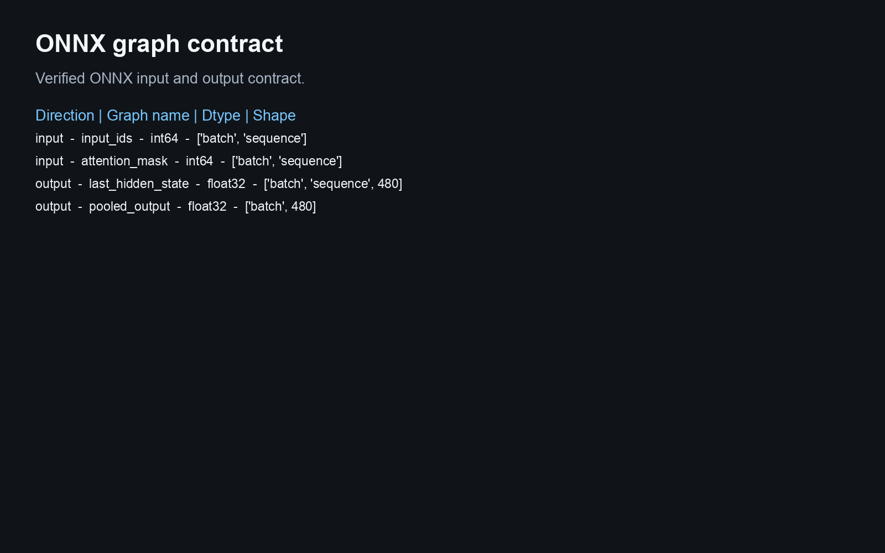
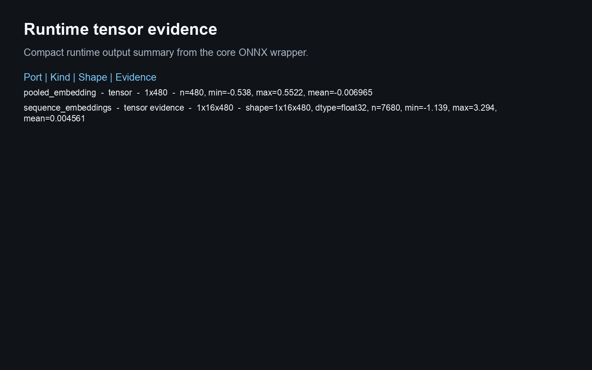
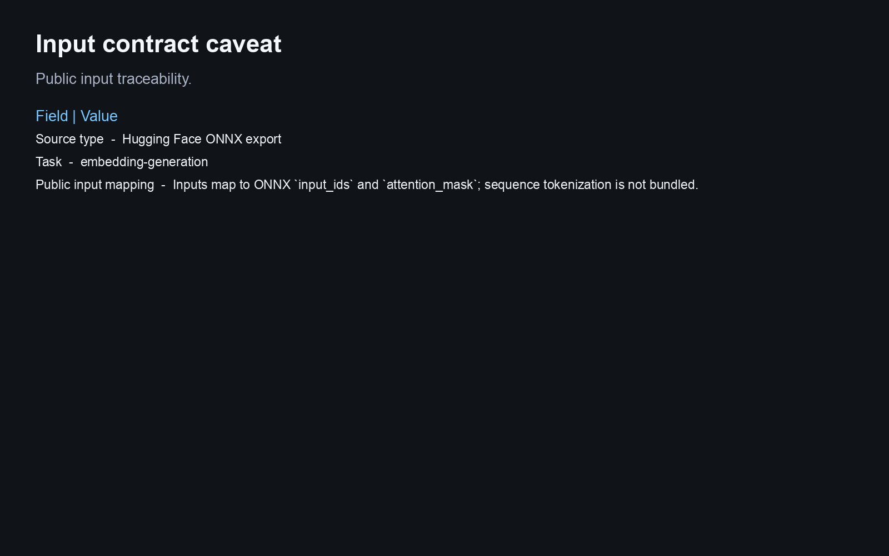

# Hf Facebook Esm2 T1235m Ur50d

This Biosimulant lab wraps a source-derived ONNX artifact and reports runtime evidence from the bundled graph.

## Scientific Context

ESM-2 t12 protein-language embedding exported to ONNX.

## Source And Artifact

- `model`: https://huggingface.co/facebook/esm2_t12_35M_UR50D

- ONNX artifact: `models/core/artifacts/model.onnx`
- Runtime: ONNX Runtime CPU execution provider
- Validation scope: graph load, input/output contract, finite synthetic inference, Biosimulant wiring, and visual payloads

## Inputs

- `protein_sequence_token_ids`: Inputs map to ONNX `input_ids` and `attention_mask`; sequence tokenization is not bundled.
- `protein_sequence_attention_mask`: Inputs map to ONNX `input_ids` and `attention_mask`; sequence tokenization is not bundled.

The lab does not add raw image, raw text, raw protein sequence, tokenizer, or medical-image preprocessing unless that
preprocessing is bundled and validated. Public inputs are already-preprocessed tensors matching the ONNX graph contract.

## Outputs

- `sequence_embeddings`: Compact embedding evidence derived from the source ONNX graph output.
- `pooled_embedding`: Compact embedding evidence derived from the source ONNX graph output.

## Visualisations

The visualisation answers:

> What protein embedding tensors does the ESM-2 t12 ONNX export emit for these already-tokenized protein sequence inputs?

It shows provenance, graph schema, runtime tensor evidence, and a conservative caveat. Synthetic inference is a runtime
smoke test, not biological, clinical, or microscopy performance evidence.

<!-- BIOSIMULANT_VISUALS_START -->

<!-- BIOSIMULANT_VISUALS_END -->

## Caveat

No tokenizer is bundled, so public inputs are token tensors rather than amino-acid sequence strings.
