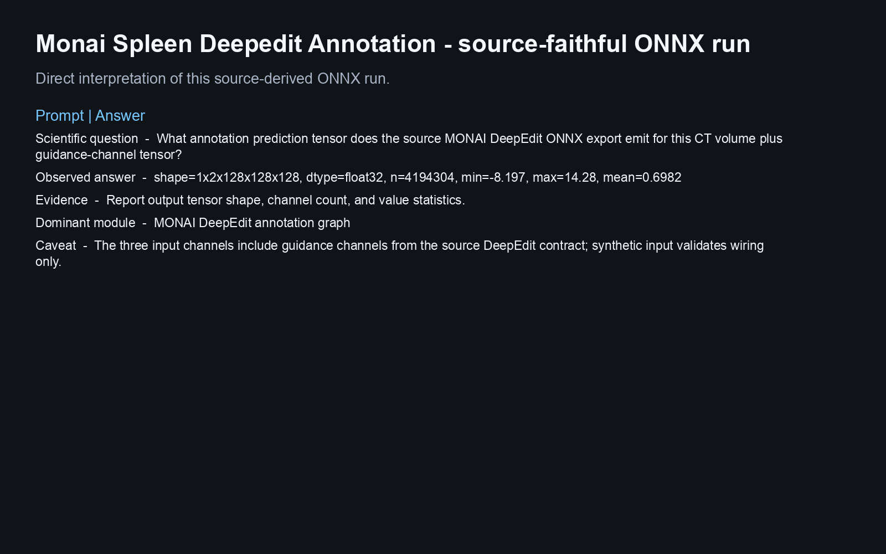
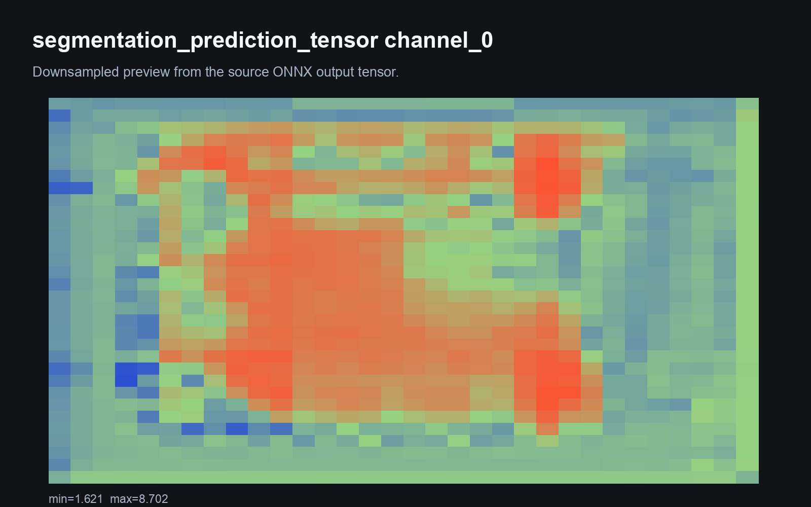
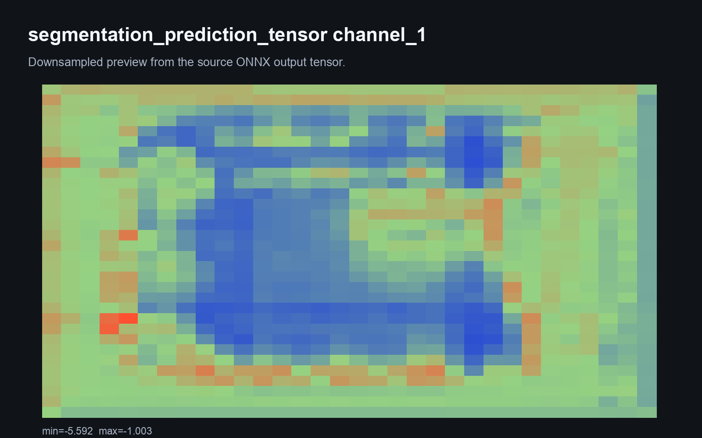
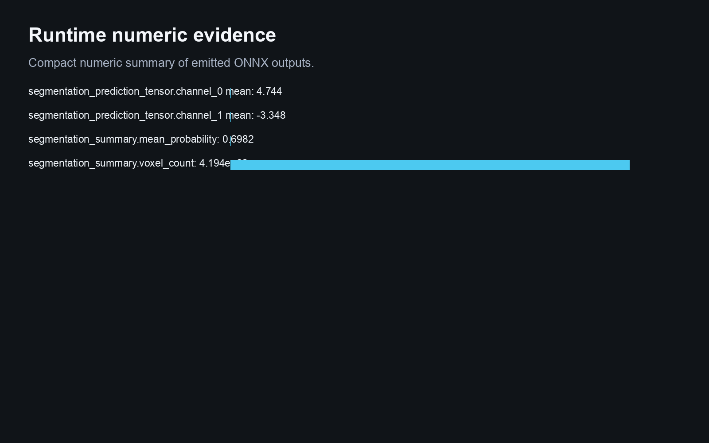
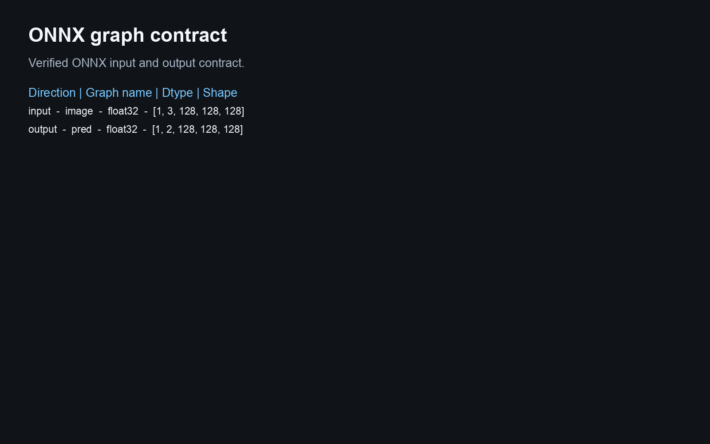
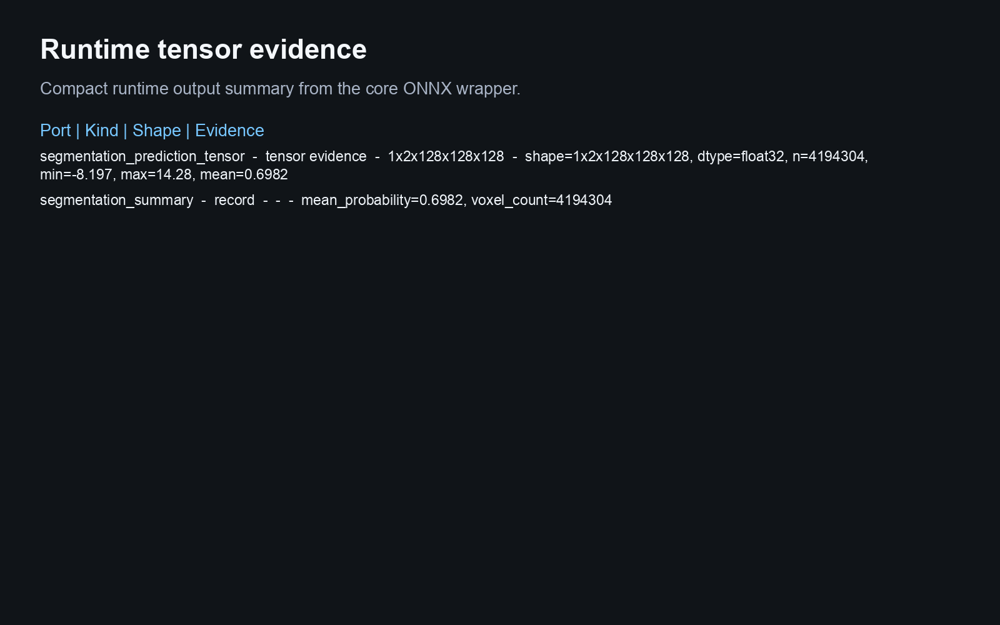
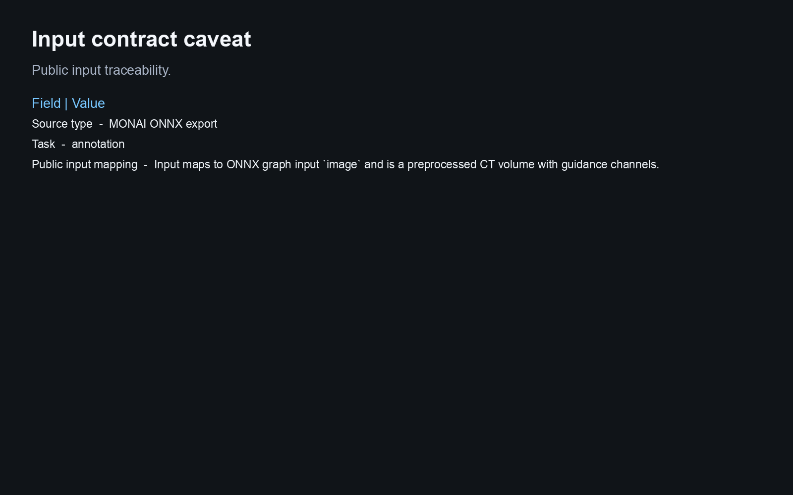

# Monai Spleen Deepedit Annotation

This Biosimulant lab wraps a source-derived ONNX artifact and reports runtime evidence from the bundled graph.

## Scientific Context

Spleen DeepEdit annotation exported from a MONAI bundle.

## Source And Artifact

- `bundle`: https://api.ngc.nvidia.com/v2/models/nvidia/monaihosting/spleen_deepedit_annotation/versions/0.1.0/files/spleen_deepedit_annotation_v0.1.0.zip

- ONNX artifact: `models/core/artifacts/model.onnx`
- Runtime: ONNX Runtime CPU execution provider
- Validation scope: graph load, input/output contract, finite synthetic inference, Biosimulant wiring, and visual payloads

## Inputs

- `ct_volume_with_guidance_channels`: Input maps to ONNX graph input `image` and is a preprocessed CT volume with guidance channels.

The lab does not add raw image, raw text, raw protein sequence, tokenizer, or medical-image preprocessing unless that
preprocessing is bundled and validated. Public inputs are already-preprocessed tensors matching the ONNX graph contract.

## Outputs

- `segmentation_prediction_tensor`: Compact tensor evidence derived from the source-derived ONNX graph output.
- `segmentation_summary`: Shape and value summary derived from the ONNX segmentation output tensor.

## Visualisations

The visualisation answers:

> What annotation prediction tensor does the source MONAI DeepEdit ONNX export emit for this CT volume plus guidance-channel tensor?

It shows provenance, graph schema, runtime tensor evidence, and a conservative caveat. Synthetic inference is a runtime
smoke test, not biological, clinical, or microscopy performance evidence.

<!-- BIOSIMULANT_VISUALS_START -->

<!-- BIOSIMULANT_VISUALS_END -->

## Caveat

The three input channels include guidance channels from the source DeepEdit contract; synthetic input validates wiring only.
